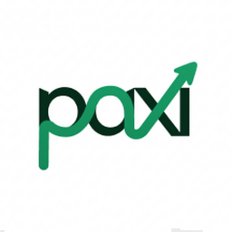
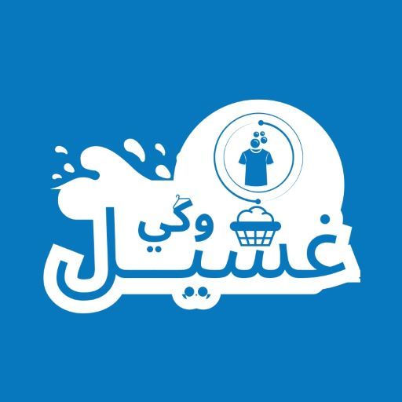
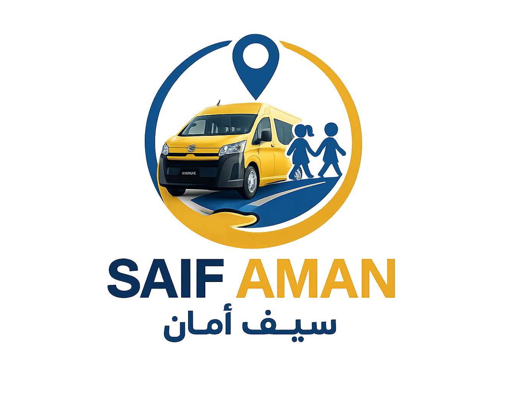

**Frontend Developer · React.js · Next.js · TypeScript**

  Building and shipping production web platforms — healthcare systems,
  ERP dashboards, real-estate CRMs, logistics, laundry platforms,
  and school transportation systems.

  
  
  
  

---

## 🚀 About Me

- 💻 **Frontend Developer** with 3+ years of professional experience
- 🏥 Healthcare management systems, hospital portals, and medical dashboards
- 🏠 Real-estate CRMs and multi-tenant SaaS dashboards
- 📦 Logistics and delivery platforms with real-time tracking
- 🧺 Laundry platforms with bilingual dashboards and order management
- 🚌 School bus tracking and transportation safety platforms
- 🌍 RTL / LTR localization for Arabic and English applications
- 🎨 Clean, scalable, responsive, and user-friendly interfaces

---

## 🛠️ Tech Stack

**Languages**

**Frontend**

**UI & Styling**

**Forms, i18n & Tools**

---

## 💼 Experience

**🏥 Newulm** — Frontend Developer  
Jan 2025 – May 2026 · Amman, Jordan

- Built a healthcare management system, hospital website, and admin dashboard
- Developed patient portals, doctor tracking, and real-time nursing dashboards
- Stack: **Next.js, React.js, TypeScript**

**💼 BLUE Technology** — Frontend Developer  
Jan 2024 – Dec 2024 · Cairo, Egypt

- Developed a complete ERP system with inventory, finance, and HR dashboards
- Built reusable components and scalable frontend architecture
- Stack: **React.js, Next.js, TypeScript**

**🎓 Najez Soft** — Frontend Developer  
Jan 2023 – Nov 2023 · Cairo, Egypt

- Built a university website and student management system
- Created bilingual Arabic / English admin dashboards
- Developed course registration and grade tracking interfaces

---

## 💻 Featured Projects

<table>
  <tr>
    <td width="18%" align="center" valign="middle">
      
    </td>
    <td width="32%" valign="top">
      <h3>🚚 Paxi</h3>
      <ul>
        <li><b>Smart Logistics:</b> Delivery platform connecting people and businesses with couriers.</li>
        <li><b>Real-Time Tracking:</b> Live tracking for deliveries and courier locations.</li>
        <li><b>Tech:</b> Next.js, TypeScript, Tailwind, GSAP, Lenis</li>
      </ul>
      
      
    </td>
    <td width="18%" align="center" valign="middle">
      
    </td>
    <td width="32%" valign="top">
      <h3>🏠 Est8Core</h3>
      <ul>
        <li><b>Real-Estate CRM:</b> Leads, deals, properties, commissions, branches, and teams.</li>
        <li><b>Multi-Tenant SaaS:</b> Super-admin dashboard for tenants and support.</li>
        <li><b>Tech:</b> Next.js, TypeScript, React Query, Zustand, Zod</li>
      </ul>
    </td>
  </tr>
  <tr>
    <td width="18%" align="center" valign="middle">
      
    </td>
    <td width="32%" valign="top">
      <h3>🏥 Ulm Care & Ulm Connect</h3>
      <ul>
        <li><b>Healthcare Hub:</b> Appointments, patient services, and medical records.</li>
        <li><b>Ulm Connect:</b> Provider dashboard for doctors, nurses, labs, and home visits.</li>
        <li><b>Tech:</b> React.js, Redux, React Query, Firebase, Google Maps</li>
      </ul>
      
      
    </td>
    <td width="18%" align="center" valign="middle">
      
    </td>
    <td width="32%" valign="top">
      <h3>🧺 Gassel Kai</h3>
      <ul>
        <li><b>Laundry Platform:</b> Pickup, wash, iron, and delivery with bilingual dashboards.</li>
        <li><b>Admin Panel:</b> Orders, plans, users, reports, and price calculator.</li>
        <li><b>Tech:</b> React.js, Vite, Tailwind, i18next, Firebase</li>
      </ul>
      
      
      
    </td>
  </tr>
  <tr>
    <td width="18%" align="center" valign="middle">
      
    </td>
    <td width="32%" valign="top">
      <h3>🚌 SAIF AMAN</h3>
      <ul>
        <li><b>School Bus Tracking:</b> Live GPS map for buses, students, and trips.</li>
        <li><b>Admin Dashboard:</b> Schools, drivers, parent requests, and alerts.</li>
        <li><b>Tech:</b> Next.js, TypeScript, Zustand, Leaflet, Shadcn</li>
      </ul>
      
      
      
    </td>
    <td width="18%"></td>
    <td width="32%"></td>
  </tr>
</table>

---

## 🎓 Education

**Bachelor of Computer Science** — Menoufia University  
Sep 2019 – Jun 2023 · Cumulative Grade: Very Good

**Information Technology Institute (ITI)**  
Jul 2023 – Sep 2023

**Languages:** 🇪🇬 Arabic · 🇬🇧 English

---

## 📊 GitHub Stats

---

### Thanks for visiting 🚀

**Let's build something great together**

